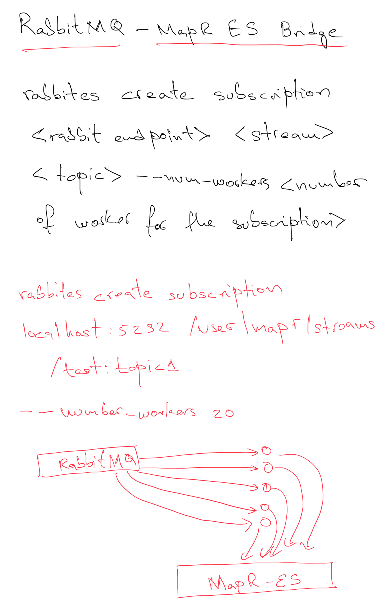

# RabbitES
A small and direct bridge between RabbitMQ and MapR-ES


The main idea is that a number of workers are created so that RabbitMQ distributed the messages across them. Each worker will try to write to the specify MapR Stream using the specified topic. If a topic is not especified, the worker will create a topic that matches the name of the queue where messages are read from in RabbitMQ. If the process of writting a message fails, the message is requeue so other worker can process it again, avoiding loosing the message.


This project is built using `Maven`. 

```bash
mvn clean compile package
```

Execute the following command to run it.

```bash
java -cp "/opt/mapr/lib/*:rabbites-1.0.0.jar:." -Djava.library.path=/opt/mapr/lib com.github.anicolaspp.rabbites.App -r localhost -w 2 -q hello --stream /user/mapr/streams/bridge -t mytopic
```

This will create 2 workers (`-w 2`) connect them to `localhost` (`-r localhost`) that read from queue `hello` (`-q hello`). Each message published to RabbitMQ is disributed to the workers for better balancing and work distribution. Each worker will write each message to `/user/mapr/streams/bridge` (`--stream /user/mapr/streams/bridge`) on the specified topic `mytopic` (`-t mytopic`).

Make sure the target stream is create before hand. You can use `maprcli` in the following way to achieve this task.

```
maprcli stream create -path /user/mapr/streams/bridge 
```

While messages are written to the cluster, we can inspect the target stream in different ways to make sure the process is going fine.


To get information about the stream we could run.
```
maprcli stream info -path /user/mapr/streams/bridge -json
```

If we are interested on counting the number of messages on the stream, we could run.

```
mapr streamanalyzer -path /user/mapr/streams/bridge
```

## RabbitEs Architecture Overview



